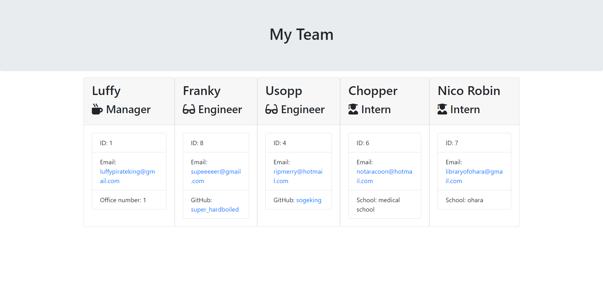

# README generator

## DESCRIPTION

This command-line application allow users to generate a professional HTML webpage that displays their team's basic info so that a user have quick access to their emails and GitHub profiles.

## Table of Contents

1. [Installation](#installation)
2. [Usage](#usage)
3. [License](#license)
4. [Contributing](#contributing)
5. [Tests](#tests)
6. [Questions](#questions)
7. [Demo](#demo)

## INSTALLATION

To set up the necessary dependencies, execute the following command:

- npm i inquirer

## USAGE

Answer to the prompts generated to create an HTML file for your team.

## LICENSE

This project is subject to the MIT licensing terms.

## CONTRIBUTING

Use this space to show useful examples of how the project can be used. Additional screenshots, code examples and demos will work well in this space. You may also link to more resources.

## TESTS

You can test the functionality running jest:

- npm install --save-dev jest

## QUESTIONS

Should you have any inquiries regarding this repository, feel free to raise an issue or reach out to me directly via [bbc.silva@gmail.com](mailto:bbc.silva@gmail.com).
Explore more of my work at [blaztted](https://www.github.com/blaztted).

## DEMO

Improvements to the visual presentation and styling are currently in progress to provide a more polished experience.

